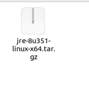
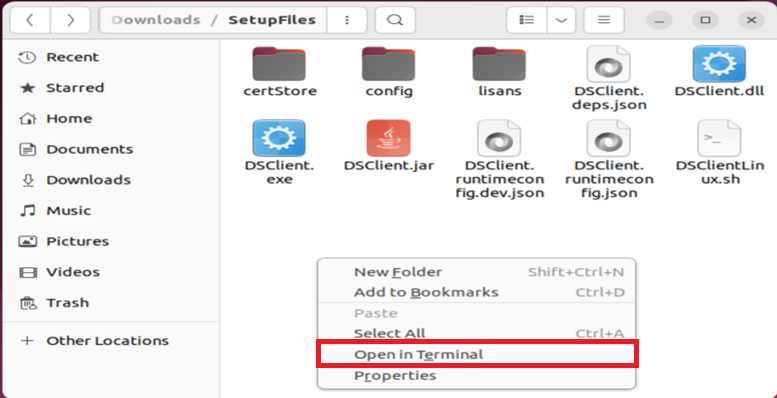
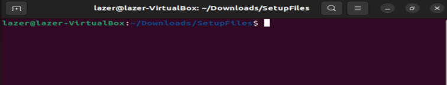
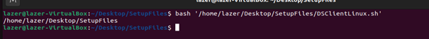
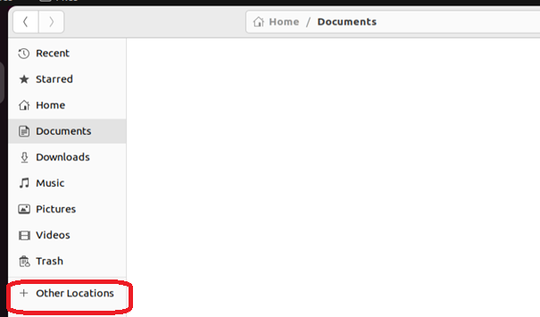
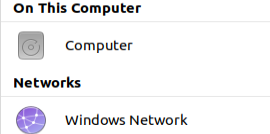
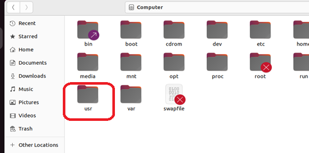
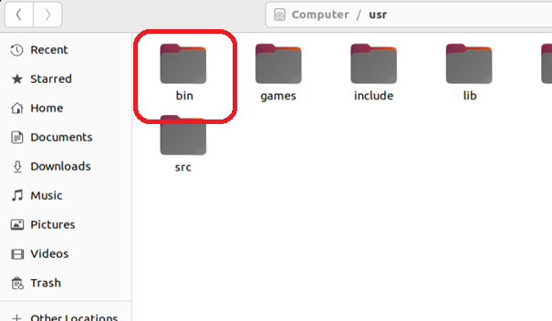
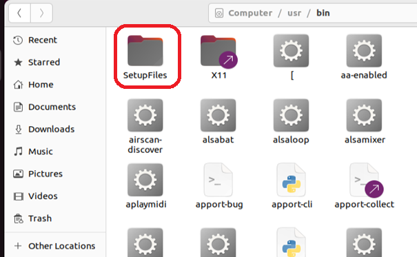


## Linux Cihazlar İçin Kurulum

### 1- Gereksinimler

Dijital İmza uygulamasını cihazınıza kurmadan önce aşağıda belirtilen Java kütüphanesinin cihazınızda kurulu olması gerekmektedir.
JRE (Java Runtime Environment) . Bu kütüphaneyi aşağıdaki linkten cihaz türünüze uygun olanı seçerek indirebilirsiniz

İndirme sayfası : https://www.java.com/tr/download/manual.jsp

Yukarıdaki linkten Java'yı indirdikten sonra indirilenler klasörünüzde görseldekine benzer bir kurulum dosyası olacaktır. Bu kurulum dosyasını açınız.



Bu kurulum dosyasını çalıştırarak Java'yı bilgisayarınıza kurun.

### 2- Dijital İmza Uygulamasının Kurulumu - Linux

Dijital İmza uygulamasının kurulumu için Linux cihazlarda bulunan terminal uygulamasından faydalanacağız.

Bunun için SetupFiles klasörünüzde boş bir alana sağ tıklayın ve gelen menüden "Terminalde Aç" veya "Open in Terminal"
seçeneğini seçin.




Terminali açtığınızda aşağıdaki görsele benzer bir ekran gelecektir. 




Bu ekranda şu komutu yazın :
```sh 
	bash
```

Ve bir boşluk bırakın

Ardından Setup Files klasöründeki DSClientMac.sh dosyasını tutup bu ekrana sürükleyin

```sh 
	bash /home/username/Downloads/SetupFiles/DSClientLinux.sh
```
Kod satırı yukardaki örneğe benzer şekilde görülecektir. Tek fark dosya konumunuz olacaktır.
Kod satırının sonundaki 1 adet boşluğu silmeniz gerekmektedir.
Ardından Enter'a basarak komutu uygulayın.

Sizden kullanıcı şifrenizi girmeniz istenecektir. 
Burada şuna dikkat edin ,linux terminalde şifrenizi yazdığınızda sanki hiçbirşey yazmıyormuş gibi görülebilir, bu normaldir.Şifrenizi yazın ve enter'a basıp onaylayın'



İşlem başarılı olması durumunda Terminal görüntüsü yukarıdaki görseldeki gibi olacak ve terminal bir alt satıra geçecektir.
Herhangi bir sorunla karşılaşmanız halinde program kendi işlem ve hata kayıtlarını oluşturmaktadır. Bu dosyalardaki kayıt mesajlarını iletmeniz durumunda sorunlarınız daha hızlı çözüme kavuşacaktır.


### 3 - Log Kayıtlarına  Nasıl Ulaşılır - Linux

Örnek Ubuntu üzerinden anlatılmıştır.

Yan menüden Files'ı açın.


Açılan pencerede other locations’u seçin.




Computer’i açın



User'ı açın.



Bin 'i açın



Bin içerisinde bulunan Setupfiles'ı açın




Setupfiles içerisinde “servicelog.err.txt” dosyası mevcuttur.
Kurulum sırasında veya bilgisayarınızı yeniden başlattıktan sonra dijital imza servisi herhangi bir hata ile karşılaşırsa buraya kayıt edecektir.
Bu dosyayı çift tıklayarak text editör ile açabilirsiniz.

Programa ait hata dışı kayıtlar yine aynı klasörde bulunan “servicelog.out.txt” dosyasında tutulmaktadır.


